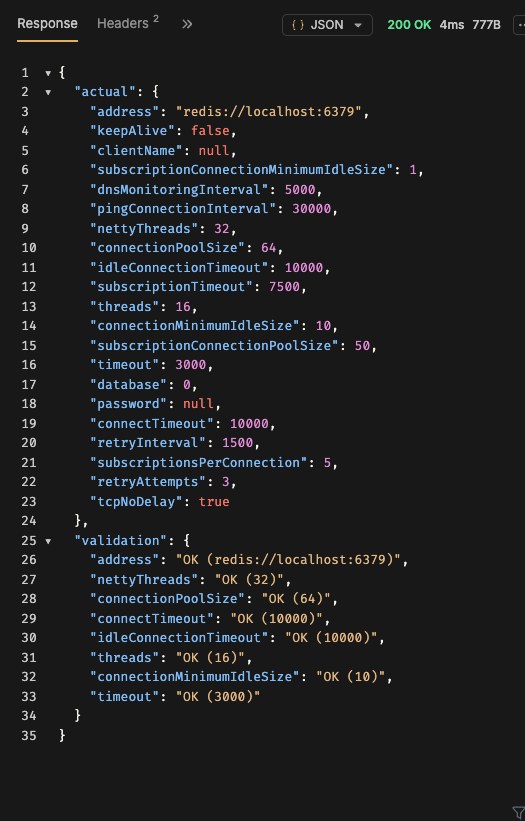

# poc-redison-30

This project uses Quarkus, the Supersonic Subatomic Java Framework.

If you want to learn more about Quarkus, please visit its website: [https://quarkus.io/](https://quarkus.io/).

## Running the application in dev mode

You can run your application in dev mode that enables live coding using:

```shell
./mvnw quarkus:dev
```

> **_NOTE:_**  Quarkus now ships with a Dev UI, which is available in dev mode only at [http://localhost:8080/q/dev/](http://localhost:8080/q/dev/).

## Packaging and running the application

The application can be packaged using:

```shell
./mvnw package
```

It produces the `quarkus-run.jar` file in the `target/quarkus-app/` directory.
Be aware that it’s not an _über-jar_ as the dependencies are copied into the `target/quarkus-app/lib/` directory.

The application is now runnable using `java -jar target/quarkus-app/quarkus-run.jar`.

If you want to build an _über-jar_, execute the following command:

```shell
./mvnw package -Dquarkus.package.jar.type=uber-jar
```

The application, packaged as an _über-jar_, is now runnable using `java -jar target/*-runner.jar`.

## Creating a native executable

You can create a native executable using:

```shell
./mvnw package -Dnative
```

Or, if you don't have GraalVM installed, you can run the native executable build in a container using:

```shell
./mvnw package -Dnative -Dquarkus.native.container-build=true
```

You can then execute your native executable with: `./target/poc-redison-30-1.0.0-SNAPSHOT-runner`

If you want to learn more about building native executables, please consult [https://quarkus.io/guides/maven-tooling](https://quarkus.io/guides/maven-tooling).

## Related Guides

- REST ([guide](https://quarkus.io/guides/rest)): A Jakarta REST implementation utilizing build time processing and Vert.x. This extension is not compatible with the quarkus-resteasy extension, or any of the extensions that depend on it.
- REST Jackson ([guide](https://quarkus.io/guides/rest#json-serialisation)): Jackson serialization support for Quarkus REST. This extension is not compatible with the quarkus-resteasy extension, or any of the extensions that depend on it

## Provided Code

### REST

Easily start your REST Web Services

[Related guide section...](https://quarkus.io/guides/getting-started-reactive#reactive-jax-rs-resources)

# poc-redisson-30-config



config values for quarkus :

```
{
  "note": "Propiedades leídas por reflexión desde SingleServerConfig y BaseConfig de Redisson 3.43.0",
  "rootProps": [
    {
      "type": "int",
      "currentValue": "16",
      "property": "quarkus.redisson.threads"
    },
    {
      "type": "int",
      "currentValue": "32",
      "property": "quarkus.redisson.netty-threads"
    },
    {
      "type": "String",
      "currentValue": "null — usa application.yml",
      "property": "quarkus.redisson.file"
    }
  ],
  "singleServerConfig_ownFields": [
    {
      "property": "quarkus.redisson.single-server-config.address",
      "type": "String",
      "currentValue": "redis://localhost:6379"
    },
    {
      "property": "quarkus.redisson.single-server-config.connection-minimum-idle-size",
      "type": "int",
      "currentValue": "10"
    },
    {
      "property": "quarkus.redisson.single-server-config.connection-pool-size",
      "type": "int",
      "currentValue": "64"
    },
    {
      "property": "quarkus.redisson.single-server-config.database",
      "type": "int",
      "currentValue": "0"
    },
    {
      "property": "quarkus.redisson.single-server-config.dns-monitoring-interval",
      "type": "long",
      "currentValue": "5000"
    },
    {
      "property": "quarkus.redisson.single-server-config.subscription-connection-minimum-idle-size",
      "type": "int",
      "currentValue": "1"
    },
    {
      "property": "quarkus.redisson.single-server-config.subscription-connection-pool-size",
      "type": "int",
      "currentValue": "50"
    }
  ],
  "singleServerConfig_inheritedFromBaseConfig": [
    {
      "property": "quarkus.redisson.single-server-config.client-name",
      "type": "String",
      "currentValue": "null"
    },
    {
      "property": "quarkus.redisson.single-server-config.command-mapper",
      "type": "CommandMapper",
      "currentValue": "org.redisson.config.DefaultCommandMapper@2589a61c"
    },
    {
      "property": "quarkus.redisson.single-server-config.connect-timeout",
      "type": "int",
      "currentValue": "10000"
    },
    {
      "property": "quarkus.redisson.single-server-config.credentials-resolver",
      "type": "CredentialsResolver",
      "currentValue": "org.redisson.client.DefaultCredentialsResolver@1ae92d8"
    },
    {
      "property": "quarkus.redisson.single-server-config.idle-connection-timeout",
      "type": "int",
      "currentValue": "10000"
    },
    {
      "property": "quarkus.redisson.single-server-config.keep-alive",
      "type": "boolean",
      "currentValue": "false"
    },
    {
      "property": "quarkus.redisson.single-server-config.name-mapper",
      "type": "NameMapper",
      "currentValue": "org.redisson.api.DefaultNameMapper@6b734ef8"
    },
    {
      "property": "quarkus.redisson.single-server-config.password",
      "type": "String",
      "currentValue": "null"
    },
    {
      "property": "quarkus.redisson.single-server-config.ping-connection-interval",
      "type": "int",
      "currentValue": "30000"
    },
    {
      "property": "quarkus.redisson.single-server-config.retry-attempts",
      "type": "int",
      "currentValue": "3"
    },
    {
      "property": "quarkus.redisson.single-server-config.retry-interval",
      "type": "int",
      "currentValue": "1500"
    },
    {
      "property": "quarkus.redisson.single-server-config.ssl-ciphers",
      "type": "String[]",
      "currentValue": "null"
    },
    {
      "property": "quarkus.redisson.single-server-config.ssl-enable-endpoint-identification",
      "type": "boolean",
      "currentValue": "true"
    },
    {
      "property": "quarkus.redisson.single-server-config.ssl-key-manager-factory",
      "type": "KeyManagerFactory",
      "currentValue": "null"
    },
    {
      "property": "quarkus.redisson.single-server-config.ssl-keystore",
      "type": "URL",
      "currentValue": "null"
    },
    {
      "property": "quarkus.redisson.single-server-config.ssl-keystore-password",
      "type": "String",
      "currentValue": "null"
    },
    {
      "property": "quarkus.redisson.single-server-config.ssl-keystore-type",
      "type": "String",
      "currentValue": "null"
    },
    {
      "property": "quarkus.redisson.single-server-config.ssl-protocols",
      "type": "String[]",
      "currentValue": "null"
    },
    {
      "property": "quarkus.redisson.single-server-config.ssl-provider",
      "type": "SslProvider",
      "currentValue": "JDK"
    },
    {
      "property": "quarkus.redisson.single-server-config.ssl-trust-manager-factory",
      "type": "TrustManagerFactory",
      "currentValue": "null"
    },
    {
      "property": "quarkus.redisson.single-server-config.ssl-truststore",
      "type": "URL",
      "currentValue": "null"
    },
    {
      "property": "quarkus.redisson.single-server-config.ssl-truststore-password",
      "type": "String",
      "currentValue": "null"
    },
    {
      "property": "quarkus.redisson.single-server-config.ssl-verification-mode",
      "type": "SslVerificationMode",
      "currentValue": "STRICT"
    },
    {
      "property": "quarkus.redisson.single-server-config.subscription-timeout",
      "type": "int",
      "currentValue": "7500"
    },
    {
      "property": "quarkus.redisson.single-server-config.subscriptions-per-connection",
      "type": "int",
      "currentValue": "5"
    },
    {
      "property": "quarkus.redisson.single-server-config.tcp-keep-alive-count",
      "type": "int",
      "currentValue": "0"
    },
    {
      "property": "quarkus.redisson.single-server-config.tcp-keep-alive-idle",
      "type": "int",
      "currentValue": "0"
    },
    {
      "property": "quarkus.redisson.single-server-config.tcp-keep-alive-interval",
      "type": "int",
      "currentValue": "0"
    },
    {
      "property": "quarkus.redisson.single-server-config.tcp-no-delay",
      "type": "boolean",
      "currentValue": "true"
    },
    {
      "property": "quarkus.redisson.single-server-config.tcp-user-timeout",
      "type": "int",
      "currentValue": "0"
    },
    {
      "property": "quarkus.redisson.single-server-config.timeout",
      "type": "int",
      "currentValue": "3000"
    },
    {
      "property": "quarkus.redisson.single-server-config.username",
      "type": "String",
      "currentValue": "null"
    }
  ]
}
```
